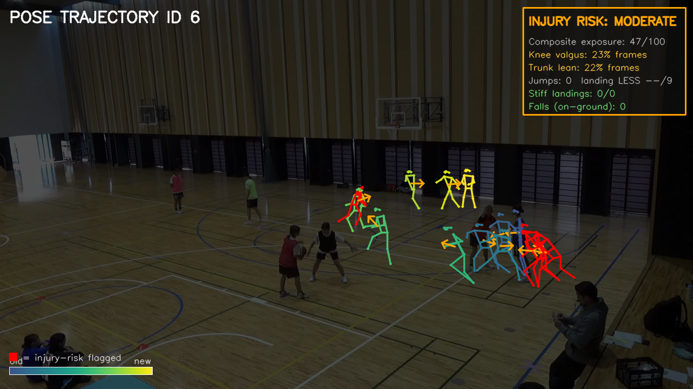

# Sport Monitoring — Basketball Injury-Risk Analysis

Estimate **landing injury risk** for basketball players from ordinary game/practice
video. The pipeline detects and tracks every player, estimates each one's 2D pose,
and — for a chosen player — detects jumps, scores each landing with a **LESS-inspired**
(Landing Error Scoring System) rubric, flags falls, and exports per-frame joint
angles for downstream analysis.

It is built as a **top-down** pipeline so it works on wide gym shots where players
are only ~40–70 px tall:

- **YOLO (Ultralytics) + ByteTrack** — detect players and assign stable track ids.
- **RTMPose** (via [rtmlib](https://github.com/Tau-J/rtmlib) + ONNXRuntime) —
  17 COCO keypoints per player, each estimated at their own scale.
- **Biomechanics / landing / fall / risk** modules — turn keypoints into joint
  angles, jump+landing events, LESS subset scores, and a per-player risk summary.

Managed with the [uv](https://docs.astral.sh/uv/) package manager.

> Pluggable backbones: the analyze pipeline can swap the detector (`yolo` ↔ `rfdetr`)
> and the pose model (`rtm` ↔ `mediapipe`) for benchmarking. See
> [`docs/INJURY_ANALYSIS.md`](docs/INJURY_ANALYSIS.md) for the method, metric
> definitions, and the backbone comparison.

> 🚀 **Live demo:** [**sport-monitoring.taspolsd.dev**](https://sport-monitoring.taspolsd.dev/) —
> upload a clip, click the player to analyse, and view the annotated result in the browser.

---

## Results

A few representative outputs from the pipeline. Try them yourself on the
[**live demo**](https://sport-monitoring.taspolsd.dev/).

### Trajectory analysis

A strobe / trajectory map of the analysed player: jump and landing events are placed
along the foot-line path, so you can read the take-off and touch-down moments at a
glance alongside the per-landing LESS-inspired risk.



### Indoor tracking with details

Close-range indoor footage: every player is detected and given a stable id, with the
17-keypoint skeleton and per-player overlay (joint angles, jump/landing banners)
rendered each frame.

https://github.com/Taspol/sport_monitoring/raw/main/asset/basket_S1T2_pre_pose.mp4

### Outdoor tracking — reliable through a fall

Wide outdoor footage where the players are small in frame. Tracking stays locked on
through occlusion and a **fall**, which the fall detector flags — the case that
matters most for injury monitoring.

https://github.com/Taspol/sport_monitoring/raw/main/asset/outdoor1_fall2_clean.mp4

> The `.mp4` clips embed inline on GitHub. If a viewer doesn't render them, open
> [`asset/basket_S1T2_pre_pose.mp4`](asset/basket_S1T2_pre_pose.mp4) and
> [`asset/outdoor1_fall2_clean.mp4`](asset/outdoor1_fall2_clean.mp4) directly.

---

## Dataset & citation

The sample footage used in this project (the clips above and the videos under
`data/`) is sourced from **TrackID3x3**, a dataset of fixed-camera indoor, outdoor,
and drone-captured 3x3 basketball footage with player bounding boxes and pose
keypoints.

- **Repository:** [open-starlab/TrackID3x3](https://github.com/open-starlab/TrackID3x3)
- **Paper:** Yamada et al., *TrackID3x3: A Dataset for 3x3 Basketball Player Tracking
  and Identification*, arXiv:2503.18282 (2025) —
  [arxiv.org/abs/2503.18282](https://arxiv.org/abs/2503.18282)
- **License:** dataset under [CC BY 4.0](https://creativecommons.org/licenses/by/4.0/)
  (code under Apache-2.0). Attribution is provided per the CC BY 4.0 terms.

```bibtex
@article{yamada2025trackid3x3,
  title={TrackID3x3: A Dataset for 3x3 Basketball Player Tracking and Identification},
  author={Yamada, Kazuhiro and Yin, Li and Hu, Qingrui and Ding, Ning and Iwashita, Shunsuke and Ichikawa, Jun and Kotani, Kiwamu and Yeung, Calvin and Fujii, Keisuke},
  journal={arXiv preprint arXiv:2503.18282},
  year={2025}
}
```

> This project is an independent analysis pipeline built on top of that footage; it
> is not affiliated with or endorsed by the TrackID3x3 authors.

---

## Setup

Requires Python 3.10–3.12 and [uv](https://docs.astral.sh/uv/getting-started/installation/).

```bash
uv sync
```

This creates a `.venv` and installs the core dependencies. YOLO weights are bundled
in `models/`; the RTMPose ONNX model is downloaded once on first run and cached under
`~/.cache/rtmlib`.

### Dependency groups

Everything needed to run the code is declared in `pyproject.toml`, split into the
core deps plus two optional [extras](https://docs.astral.sh/uv/concepts/projects/dependencies/#optional-dependencies):

| Install | Command | Adds |
|---------|---------|------|
| **Core** (CLI) | `uv sync` | opencv-python, numpy, scipy, requests, tqdm, ultralytics, rtmlib, onnxruntime, lap |
| **Web demo** | `uv sync --extra web` | gradio (see [`demo_web/`](demo_web/README.md)) |
| **Alt backbones** | `uv sync --extra benchmark` | mediapipe, rfdetr, supervision (for `--detector`/`--pose`) |
| **Everything** | `uv sync --extra web --extra benchmark` | all of the above |

> Extras are exclusive per `uv sync`: naming only one **prunes** the others. To keep
> the web demo *and* the alt backbones installed, sync both together (the last row).

**System dependency:** the web demo also needs [`ffmpeg`](https://ffmpeg.org/) on
your `PATH` (for browser-friendly H.264 re-encoding) — it is not a Python package:
`brew install ffmpeg` (macOS) or `apt install ffmpeg` (Debian/Ubuntu).

Put your input videos in `./data/` (or pass file paths explicitly).

---

## Quickstart

Analyze one player's landing biomechanics (the main use case):

```bash
uv run sport-monitoring data/basket_S1T3_pre.mp4 --analyze
```

This opens a one-click selection window to pick the player, then writes an annotated
video plus CSV/summary artifacts to `./output/` (see [Outputs](#outputs)).

Run it headless (no click) by auto-selecting the jumper, with 3D cuboid boxes:

```bash
uv run sport-monitoring data/basket_S1T3_pre.mp4 --analyze --auto-select --3d
```

---

## Modes

The tool has three mutually exclusive modes:

| Mode | Flag | What it does |
|------|------|--------------|
| **Injury analysis** | `--analyze` | Pick **one** player; detect jumps, score landings (LESS subset), flag falls, export joint angles + risk summary. |
| **Track-all** | `--track-all` | Track **every** player automatically; `FusedTracker` keeps ids stable through occlusion. |
| **Registry (default)** | *(none)* | Register every player from a reference frame, then follow each by id + box + jersey-colour. |

### Selecting the player (analyze mode)

- **Default:** a preview window opens — click the player to analyze, then press **ENTER**.
- **`--auto-select`:** no window; the player with the largest **vertical foot-line
  excursion** (i.e. the jumper) is picked automatically, so `--analyze` runs headless
  or in batch.

> The interactive selection window needs a display. On a headless machine use
> `--auto-select` (analyze) or `--track-all`.

---

## Options

| Flag | Default | Description |
|------|---------|-------------|
| `inputs` | all of `./data` | Specific video file(s) to process. |
| `--analyze` | off | Injury-analysis mode (one player). |
| `--track-all` | off | Track every detected player. |
| `--auto-select` | off | (analyze) Auto-pick the jumper; run headless. |
| `--3d` | off | Render orientation-aware 3D cuboids + a live per-person move arrow instead of flat boxes. |
| `--detector` | `yolo` | (analyze) Detector backbone: `yolo` or `rfdetr`. |
| `--pose` | `rtm` | (analyze) Pose backbone: `rtm` (RTMPose) or `mediapipe` (BlazePose→COCO-17). |
| `--select-frame` | 0 | Reference frame index to open selection / register from. |
| `--person-conf` | 0.3 | Minimum person-detection confidence (0–1). |
| `--data-dir` | `./data` | Folder scanned when no inputs are given. |
| `--output-dir` | `./output` | Where results are written. |
| `--no-video` | off | Skip rendering; only print stats. |
| `--debug` | off | Per-person debug panel (stable id, raw id, colour-sim %, watchdog, conf). |

Non-default backbones write to `output/<detector>_<pose>/` so passes don't clobber
the canonical `yolo+rtm` outputs and stay grouped for the comparison table.

---

## Outputs

In analyze mode, each clip `<name>` produces (in `--output-dir`):

| File | Contents |
|------|----------|
| `<name>_injury.mp4` | Annotated video: skeletons, boxes/cuboids, jump + LESS banners, risk overlay. |
| `<name>_clean.mp4` | Same tracking, no analysis overlays. |
| `<name>_joint_angles.csv` | Per-frame knee flexion/valgus, hip flexion, trunk lean + risk flags. |
| `<name>_jumps.csv` | Detected jumps: apex / initial-contact / max-flexion frames, LESS score. |
| `<name>_falls.csv` | Detected falls: start / end / lowest frame + metrics. |
| `<name>_pose_track.csv` | Per-frame keypoints of the analyzed player. |
| `<name>_risk_summary.txt` | Human-readable per-player risk report. |
| `<name>_pose_trajectory.png` | Strobe image of the player's pose over the landing. |
| `<name>_pose_trajectory_risk.png` | Strobe image highlighting risky frames. |
| `<name>_trajectory_map.png` | Court-space path of tracked players. |
| `<name>_identities.json` | Stable id → jersey colour registry. |
| `<name>_timing.json` | Frames / seconds / FPS for the benchmark. |

Track-all and registry modes write `output/<name>_pose.mp4`.

---

## Project layout

```
sport_monitoring/
├── data/                      # input videos (not tracked)
├── models/                    # bundled YOLO weights (.pt)
├── output/                    # results (videos, CSVs, PNGs, JSON)
├── benchmark/labels.csv       # ground-truth landing labels for evaluation
├── docs/INJURY_ANALYSIS.md    # method, metrics, backbone comparison
├── scripts/
│   ├── evaluate.py            # score predictions vs labels; compare backbones
│   └── diagnose_tracking.py   # tracking diagnostics
├── pyproject.toml             # uv / project metadata + benchmark extra
└── src/sport_monitoring/
    ├── cli.py                 # command-line entry point
    ├── pipeline.py            # end-to-end per-video processing (all 3 modes)
    ├── config.py             # paths, model URLs, and all tunable thresholds
    ├── video.py               # video discovery, reading, writing
    ├── sport_bytetrack.yaml   # tuned ByteTrack config (longer track_buffer)
    ├── perception/            # detection + pose backbones
    │   ├── detector.py        #   YOLO + ByteTrack person detection + ids
    │   ├── detector_rfdetr.py #   RF-DETR detector backbone (benchmark)
    │   ├── rtm_pose.py        #   RTMPose estimator (rtmlib + ONNXRuntime)
    │   ├── pose_mediapipe.py  #   BlazePose→COCO-17 pose backbone (benchmark)
    │   └── backbones.py       #   detector/pose backbone factory + protocols
    ├── tracking/              # identity, tracking, selection
    │   ├── tracker.py         #   FusedTracker / FusedSelectedTracker (id stability)
    │   ├── selector.py        #   click-to-select + auto-select (jumper) picking
    │   ├── color_id.py        #   pose-guided jersey-colour identity
    │   └── identity.py        #   legacy IDStabilizer (kept; superseded by tracker)
    ├── analysis/              # biomechanics → events → risk
    │   ├── biomechanics.py    #   joint angles (knee, hip, trunk) from keypoints
    │   ├── landing.py         #   jump + landing detection, LESS subset scoring
    │   ├── fall.py            #   fall detection from keypoint geometry
    │   └── risk.py            #   per-player risk aggregation + report
    └── render/
        └── visualize.py       #   skeletons, boxes/cuboids, overlays, banners
```

Each subpackage re-exports its main classes/functions, so e.g.
`from sport_monitoring.perception import PersonDetector` and
`from sport_monitoring.tracking import FusedTracker` work directly.

---

## Keeping player ids stable through occlusion

Players constantly cross and occlude each other, and ByteTrack matches on motion
only — so a player who is occluded or leaves frame tends to get a **new id** on
reappearance. `tracker.py` keeps ids stable with:

- **Wider track buffer** (`sport_bytetrack.yaml`): lost tracks survive ~90 frames,
  bridging short occlusions inside the tracker.
- **`FusedTracker` / `FusedSelectedTracker`**: fuse ByteTrack motion with a
  **pose-guided jersey-colour** cue (HS histogram sampled at the torso keypoints)
  and a Kalman position prediction, re-linking a reappearing player to their
  original stable id instead of minting a new one.

Same-jersey **teammates** still can't be told apart by colour alone — that needs
jersey-number recognition. The colour and id-stability knobs (`COLOR_ID_*`,
`SELECT_*`, `STABILIZER_*`) live in `config.py`.

---

## Benchmarking backbones

The analyze pipeline can run with alternative detector/pose backbones and be scored
against hand labels in `benchmark/labels.csv`:

```bash
# Run all four detector × pose combinations headless
for det in yolo rfdetr; do for pose in rtm mediapipe; do
  uv run sport-monitoring data/basket_S1T3_pre.mp4 \
    --analyze --auto-select --detector $det --pose $pose
done; done

# Score + compare
uv run python scripts/evaluate.py --variants yolo_rtm,yolo_mediapipe,rfdetr_rtm,rfdetr_mediapipe
```

Metrics (precision/recall/F1 of landing detection, initial-contact frame error,
LESS MAE/bias/Pearson r/ICC, FPS) and the full results table with paper-ready
definitions are in [`docs/INJURY_ANALYSIS.md`](docs/INJURY_ANALYSIS.md).

---

## Models

| Model | Location | Purpose |
|-------|----------|---------|
| YOLO (`yolo26m.pt`, default) | `models/` | Person detection + tracking |
| RTMPose-m (body7, COCO-17) | `~/.cache/rtmlib/...` | Pose estimation (downloaded on first run) |
| BlazePose `.task` | `~/.cache/sport_monitoring/` | `--pose mediapipe` (downloaded on first run) |

Swap the YOLO model via `YOLO_MODEL_NAME` in `config.py` (other `.pt` weights are
already bundled in `models/`).

---

## Configuration

All tunables live in `config.py`, grouped by concern: model URLs/sizes, detection
confidence and de-duplication, ByteTrack, id-stability and colour-identity gates,
keypoint score threshold (`MIN_LANDMARK_VISIBILITY`), landing/jump/fall thresholds,
3D cuboid geometry, and trajectory-arrow settings. Edit values there rather than
hard-coding them in the pipeline.
